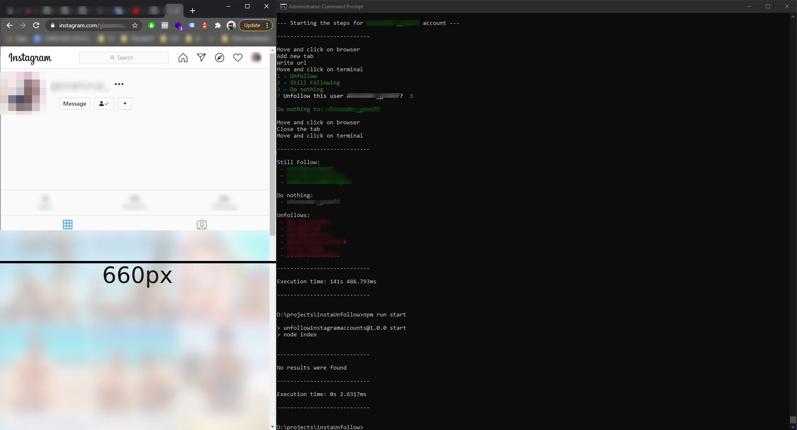

<p style="text-align:center;">
    
</p>
<p style="text-align:center;">
    
    
</p>
<p style="text-align:center;">
    Node application to unfollow accounts on Instagram
</p>

---

## Contents

- [Important](#important)
- [Story](#story)
- [Configurations](#configurations)
- [How I got my data](#how-i-got-my-data)
    - [Open the modal](#open-the-modal)
    - [Definning the scrollingToEnd function](#definning-the-scrollingtoend-function)
    - [Defining the scrollinginterval varible](#defining-the-scrollinginterval-varible)
    - [Clear interval function](#clear-interval-function)
    - [Finding verified accounts](#finding-verified-accounts)
    - [Loop for save the database](#loop-for-save-the-database)
    - [Console save the data](#console-save-the-data)
    - [Download your data](#download-your-data)
    - [Putting the file on the project](#putting-the-file-on-the-project)
- [How to use](#how-to-use)
- [What does the system do?](#what-does-the-system-do)
- [Plans](#plans)
- [License](#license)

---

## Important

> You need to be previously logged into your Instagram account.

This code will not access any of your information, You will not be saving any information from your account, and not sending your data anywhere.
**It's a semi-auto process for unfollow Instagram accounts.**

Before running the entire process and making it work, review the code and understand it to answer you're possible questions.

In case you think in skip the Story below, it is fundamental to understand how I created and used the code.

---

## Story

Throughout my time using the social network, I always followed several accounts for no reason. But now, it's time to do some cleaning, and the laziness pops up (who never?). The scenario could be described as: I had a lot of things I want to still follow (like my friends) and a thousand others that I do not remember that I followed and don't want anymore (sorry in advance to a lot of cat pages).

At first, I thought of doing this process all by hand (and it did for a few minutes), I realized that the amount of accounts I was following, would take me a long time to finish.

I realize that there were some patterns within the process that I could automate in some way.

The first step was to extract the data. I used a little of my knowledge with Javascript to do the loading of all the things I followed. With all the accounts loaded, I made a loop to print them all on the console and so build own my database, see the section [How i got my data](#how-i-got-my-data).

During the extraction, I organized all the results with some criteria, like removing only the verified accounts (because at this moment there was no need for me to retrieve/unfollow them). Then I placed the results in an HTML file and added simple anchor links to open a new tab (this part was more manual, but with the help of Sublime, selecting all the lines and editing them all at the same time - at some point, I could automate it but not today!).

As I said, I did the next few steps a few times:
- Clicking on the link
- Opening
- Waiting to load
- Clicking on the unfollow button
- Confirming
- Closing the tab
- And repeating (and dying of boredom eventually).

I talked about it with my wife and joked that it would be interesting for me to make another code to make this process faster, and as a good crazy partner, she gave me the strength (and a lot of coffee) to do it. Now here I am, writing how it came to be created.
To bring to the code the unicorn in my head, I remembered a video that I had seen many years ago, which is about an [AI to play the Google Chrome Dinosaur](https://www.youtube.com/watch?v=P7XHzqZjXQs).

I thought about it because I wanted it to be in [Node.js](https://nodejs.org). I accessed the AI ​​video code on [Git](https://github.com/ivanseidel/IAMDinosaur) because I already knew it was in Node (for the sake of God's of Programmers). 

There is a package called [RobotJS](http://robotjs.io/), with good documentation and easy to understand. The package fitted my idea perfectly, and I started to automate this boring process of unfollowing accounts. As my idea is to be simple, it has a limitation that requires to be configured according to the resolution of my screen, OS, and the like, see the configurations below.

---

## Configurations

1. You will need [Node.js](https://nodejs.org/en/download) installed on your computer, version `v15.x` and the NPM `7.x`
2. I recommend using the Windows OS. (I had many problems in using the extensions needed to run on Linux. Okay, the detail that I used an extension on Windows that simulates the CLI of an Ubuntu, probably this hindered me a little in the use of the component)
3. The ideal resolution for executing the code `1920x1080`, as you will split your screen, just like the example below:
    
    > The browser needs to be a maximum of 660px, and the CMD fills up the rest of the screen.
4. Your taskbar need to stay like that: (because RobotJS, will move your cursor to this location and click there, where I hope your browser is already open)
     
5. Your keyboard need to setted in English
6. **Remember to read Docs of RobotJS to prevent executing with errors.**
    > [RobotJS > Docs > Building](http://robotjs.io/docs/building)

---

## How I got my data

- Open your profile, aka: https://www.instagram.com/<YOUR_USER_NAME>/
- Open the console of your browser (F12)
- Run all following commands:

#### Open the modal

Opens the modal of the people you follow:
```javascript
document.querySelectorAll('a.-nal3')[1].click()
```

#### Definning the scrollingToEnd function

Defining a function to scroll the modal screen to the end:
```javascript
function scrollingToEnd() {
    var elementWithScrollBar = document.querySelectorAll(`.isgrP`)[0];
    elementWithScrollBar.scroll(0, elementWithScrollBar.scrollHeight);
}
```

#### Defining the scrollingInterval varible
Defining a function in the variable, to be executed every 100 ms, to load all data:
```javascript
var scrollingInterval = setInterval(function(){
    scrollingToEnd() 
}, 100);
```

#### Clear interval function

**In this part you will need to stay alert, until the moment when Instagram is not loading any more information.**

Once finished, clear the infinite looping of the interval with the following code:
```javascript
clearInterval(scrollingInterval)
```

#### Finding verified accounts
Finding all verified accounts and removing them from the DOM:
```javascript
document.querySelectorAll('.isgrP li span[title="Verified"]').forEach(function(accVerified){
    accVerified.closest('li').remove();
})
```

#### Loop for save the database
Loop for save your data with a Instagram's URLs on a variable:
```javascript
var data = [];
document.querySelectorAll('.isgrP li').forEach(function(e){ 
    data.push('https://www.instagram.com/' + e.querySelectorAll('span a')[0].innerText);
})
```

#### Console save the data

> *This below code isn't made by me, and I don't know exactly who did it.*
> *IF YOU DID THIS PLEASE LET ME KNOW!!!! I have to give you the credits!*

Past the code in your browser:
```javascript
(function(console){
    console.save = function(data, filename){
        if(!data) {
            console.error('Console.save: No data')
            return;
        }

        if(!filename) filename = 'console.json'

        if(typeof data === "object"){
            data = JSON.stringify(data, undefined, 4)
        }

        var blob = new Blob([data], {type: 'text/json'}),
            e    = document.createEvent('MouseEvents'),
            a    = document.createElement('a')

        a.download = filename
        a.href = window.URL.createObjectURL(blob)
        a.dataset.downloadurl =  ['text/json', a.download, a.href].join(':')
        e.initMouseEvent('click', true, false, window, 0, 0, 0, 0, 0, false, false, false, false, 0, null)
        a.dispatchEvent(e)
    }
})(console)
```

#### Download your data

To use `console.save` it will look like this:
```javascript
console.save(data);
```

An archive with the name of console.json will be downloaded automatically, in your browser (if your browser doesn't ask to allow you to accept the download).

####  Putting the file on the project

With the file already downloaded, you should now place it in the following place in the code:

```
<ROOT_OF_THE_PROJECT>/bin/
```

If you have a problem with the file, see the following line to fix it, some supposed problem, [here](https://github.com/felipelssilva/unfollowInstagramAccounts/blob/main/index.js#L8).

---

## How to use

If you configured your environment correctly it will be simple to use.
- In your CMD, access the path of the project 
- Install all packages `npm i` (If the installation dont work, go back to the [configurations](#configurations), follow the steps, stay tuned as [RobotJS](http://robotjs.io/docs/building) requires some necessary dependencies)
- Execute that follow command:
    ```
    npm run start
    ```
- And enjoy, *with patience*, you will spend 10 seconds per account, to unfollow all the unnecessary accounts of your Instagram.

It will be **necessary to have your supervision** to choose the options (unfollow, do nothing, and still following), as it would be impossible for a system to know exactly which accounts I want to stop following because I still want to follow my friends.


*Note: To stop the process in CMD hit on `ctrl+c` (few times, to confirm the stop the code lol)*

---

## What does the system do?

coming soon

---

## Plans

- [x] Removing the text file format for get all data, and use a array in a JSON file
- [ ] Different way for:
    - [ ] opening the browser
    - [ ] find the my account button

---

## License

**[MIT](https://github.com/felipelssilva/unfollowInstagramAccounts/blob/main/LICENSE)**

A short and simple permissive license with conditions only requiring preservation of copyright and license notices. Licensed works, modifications and larger works may be distributed under different terms and without source code.

---

Based on a necessity.

Maintained by [Felipe Luis](https://www.felipeluis.com).